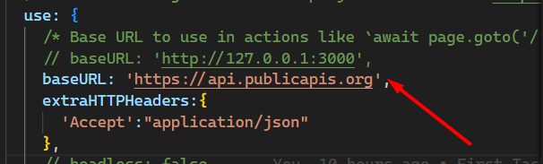
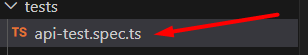
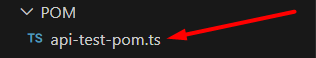
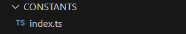
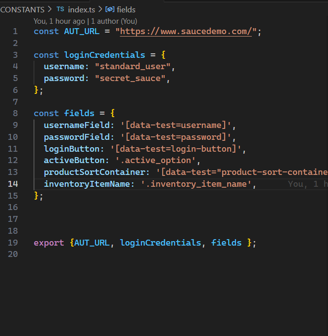
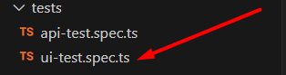
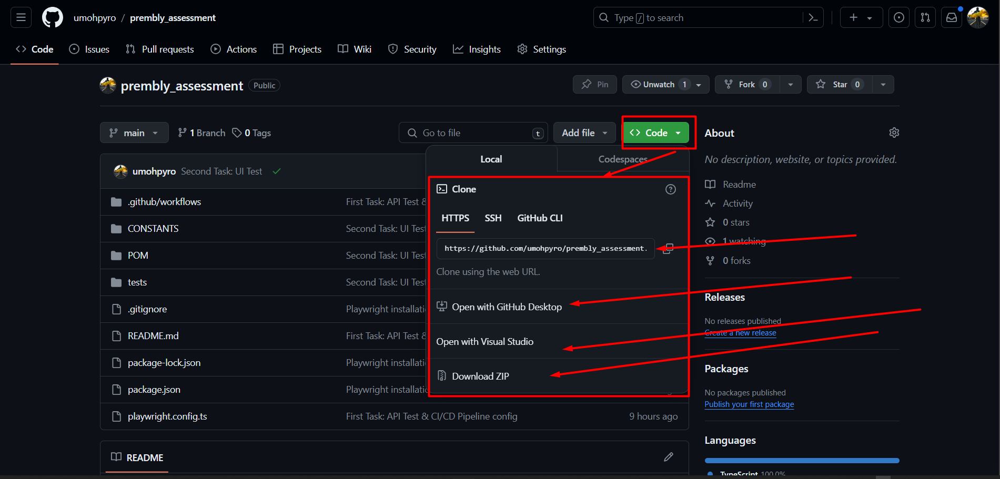

# PREMBLY TAKE HOME ASSESSMENT - By **Umoh Andem**

>***This repository contains solutions for Prembly Take Home Assessment. I used Microsoft Playwright Page Object Model to execute both tasks.***


**Task One** : Create (design and implement) an automated API test using any framework or library (e.g.,Cypress, Playwright etc.)
>The first task uses the baseURL attached to the playwright config file as presented on the screenshot below
>
>
>
>The test for the first task is inside the `api-test-spec.ts` file inside the `test` folder
>
>
>
>while the class models are stored inside the `api-test-pom.ts` file inside the `POM` folder
>
>
>

**Task Two** : Create (design and implement) an automated UI test using cypress or playwright
>For the second task, we switched things up a bit by adding a `CONSTANT` folder to store our UI element constants and other fixtures
>
>
>
>you would notice we captured and extracted the different login credentials and other constants into different variables so as to make them reusable. Refer to the screenshot below
>
>
>
>our tests are captured in the `ui-test.spec.ts` file present inside the `tests` folder
>
>
>
>while our models are captured inside the `ui-test-pom.ts` file inside the `POM` folder

## Pre-requisites

- Node.js 16+

## Running tests locally

#### Clone this repository

***NB: Project can be cloned using any acceptable method. Check attached image for sample***

```bash
git clone https://github.com/umohpyro/prembly_assessment.git
```



#### navigate to the project directory

```bash
cd prembly_assessment/
```

#### Install dependencies

```bash
npm install
```

#### Run test

To run the tests, run the following command. This command will run the tests, generate a report and open it on the browser.

```bash
npx playwright test
```

### Generate report

I integrated html reporting to the project to generate a report after running the tests. To generate the report, run the following command after running the tests.

```bash
npx playwright show-report
```

 The report will be served in the `/playwright-report` directory.

## Running tests in Github Actions CI/CD

The CI/CD pipeline is configured in the `.gitlab-ci.yml` file to run the automated test on Github using the playwright Docker runner.

To run the tests in Github CI/CD, push the code to the repository and the pipeline will be triggered automatically.

## Authors

[@Umoh Andem](https://www.github.com/umohpyro/)|

## 🤝 Contributing

Contributions, issues, and feature requests are welcome!

Feel free to check the [issues page](/issues).
